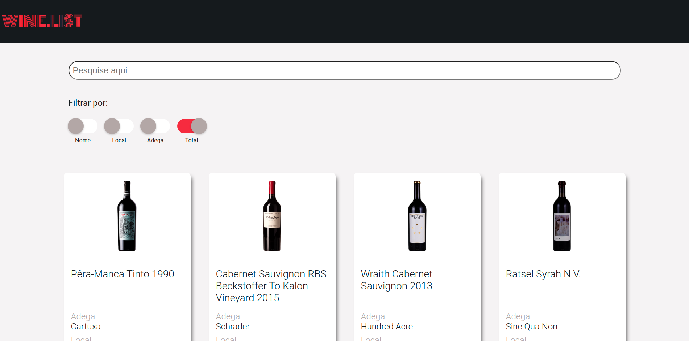

<h1>WINI LIST</h1>

<h2>Descrição do projeto</h2>

Um site que acessa e lista dados de uma API de vinhos

<h2>Tecnologias</h2>

* HTML
* CSS
* JavaScript

<h2>Link do site :globe_with_meridians:</h2>

[Link do site](https://gracious-swartz-c2814f.netlify.app/)

